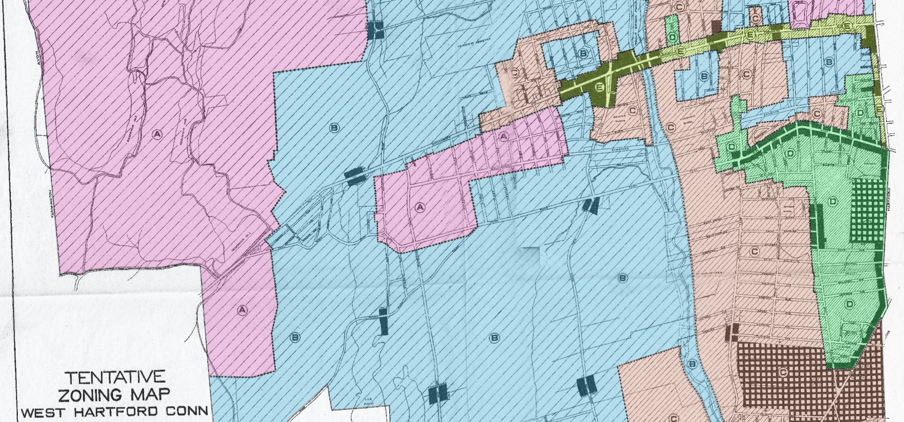

# west-hartford-zoning-1924

This repository contains a georeferenced version of West Hartford's 1924 Tentative Zoning Map, and shapefiles for use districts (residential, business, or industrial) and area districts (A through E).

## Georeferencing
The original JPG map was georeferenced using [QGIS Georeferencer](https://docs.qgis.org/3.16/en/docs/user_manual/working_with_raster/georeferencer.html) tool. About 40 ground control points were chosen (available in `georeferencing/gcp.points`). The GeoTIFF is too heavy for GitHub, but is easy to recreate.

1. Open the JPG map in Georeferencer.
1. Load GCP points file.
1. In Transformation Settings, set type to *Thin Plate Spline*, resampling method to *Nearest neighbor*, and target SRS to *EPSG:3857* (Web Mercator).
1. Hit the *Play* button to generate a GeoTIFF.

Note that western part of West Hartford is rural, with few roads and intersections that can be reliably used for georeferencing.

## Shapefiles
Shapefiles for use and area districts were manually created in QGIS. They are available from `shapefiles/` folder, as well as GeoJSONS (see `geojson/` folder).

## Notes
* Each polygon contains *acres* property with its area expressed in acres (rounded to 1 decimal).
* PDFs with semi-transparent maps were created to assess the accuracy of the output.

## License
To be determined.
